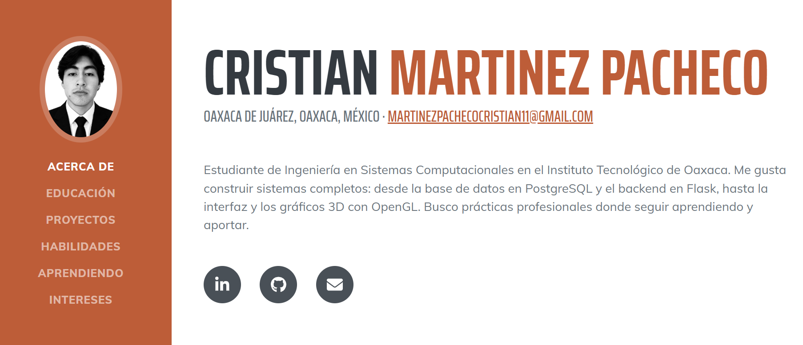
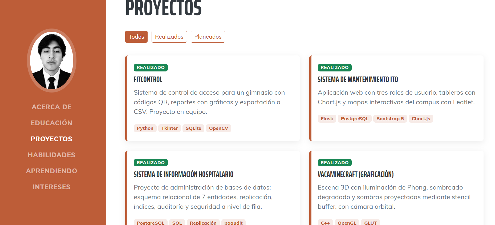
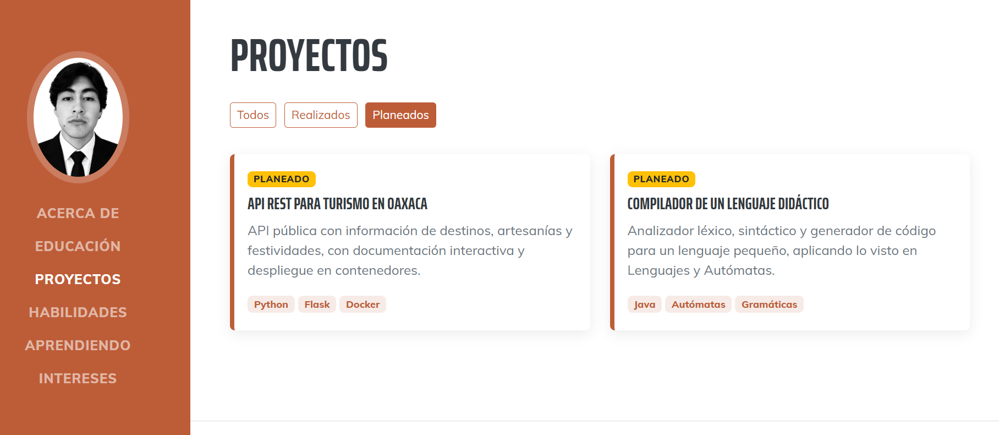

<div align="center">

# 🧑‍💻 Portafolio Personal – Cristian

**Portafolio web responsivo para presentar mi perfil, proyectos y habilidades como estudiante de Ingeniería en Sistemas Computacionales.**

Instituto Tecnológico de Oaxaca (ITO) · Actividad individual


### 🔗 [Ver el portafolio en vivo](https://cristianmartinezz1.github.io/Actividad4/)



</div>

---

## 📑 Contenido

1. [Descripción del proyecto](#-descripción-del-proyecto)
2. [Secciones del portafolio](#-secciones-del-portafolio)
3. [Proceso de creación](#-proceso-de-creación)
4. [Capturas de pantalla](#-capturas-de-pantalla)
5. [Estructura del repositorio](#-estructura-del-repositorio)
6. [Cómo ejecutarlo y publicarlo](#-cómo-ejecutarlo-y-publicarlo)
7. [Créditos y licencia](#-créditos-y-licencia)

---

## 📌 Descripción del proyecto

Este proyecto es mi portafolio personal, hecho con **HTML, CSS y JavaScript puro** (sin React, Vue ni otros frameworks de JavaScript) a partir de una plantilla de Bootstrap. Sirve para mostrar quién soy, qué estudio, qué proyectos he desarrollado y qué tecnologías domino o estoy aprendiendo.

| Dato | Detalle |
| --- | --- |
| **Framework CSS** | **Bootstrap 5.2.3** (no se mezcla con Tailwind) |
| **Plantilla** | **Resume**, de Start Bootstrap (v7.0.6) |
| **Descarga de la plantilla** | https://startbootstrap.com/theme/resume · Código fuente: https://github.com/StartBootstrap/startbootstrap-resume |
| **Licencia de la plantilla** | MIT |
| **Iconos y tipografías** | Font Awesome 6 · Google Fonts (Saira Extra Condensed y Muli) |
| **Publicación** | GitHub Pages |

### ¿Por qué esta plantilla?

Resume tiene un menú lateral fijo con foto de perfil, que lo hace parecer un currículum digital. Se adapta bien a un perfil estudiantil porque ya trae secciones de educación, habilidades e intereses, y su estructura de una sola página es sencilla de ampliar con una sección de proyectos.

---

## 🧭 Secciones del portafolio

El menú lateral (que se vuelve un menú desplegable en celular) lleva a seis secciones dentro de una sola página:

| Menú | Qué contiene |
| --- | --- |
| **Acerca de** | Portada del sitio: nombre, ubicación, correo, una descripción breve de mi perfil y los íconos de LinkedIn, GitHub y correo. |
| **Educación** | Mi carrera en el Instituto Tecnológico de Oaxaca y las materias más relevantes: bases de datos, graficación, redes, lenguajes de interfaz, lenguajes y autómatas e ingeniería de software. |
| **Proyectos** | Tarjetas con nombre, descripción, tecnologías y estado (*Realizado* o *Planeado*). Incluye un filtro para ver todos, solo los realizados o solo los planeados. |
| **Habilidades** | Íconos de lenguajes y herramientas, barras con el nivel de dominio de cada tecnología y una lista de formas de trabajo. |
| **Aprendiendo** | Tecnologías que quiero dominar (Docker, programación funcional, Node.js, redes y seguridad), con barras de avance. |
| **Intereses** | Lo que me gusta fuera del código: computación gráfica, visualización de datos y proyectos de software con impacto local. |

---

## 🛠️ Proceso de creación

### Paso 1. Descargar y revisar la plantilla
Descargué Resume desde Start Bootstrap y revisé su estructura: un `index.html`, un `css/styles.css` (Bootstrap compilado más el tema), un `js/scripts.js` y una carpeta `assets/img`. Identifiqué qué partes conservar (menú lateral, scrollspy, estilo general) y cuáles adaptar.

### Paso 2. Reorganizar los archivos
La actividad pide una estructura concreta, así que renombré y moví los archivos:

| Plantilla original | Mi proyecto |
| --- | --- |
| `css/styles.css` | `css/portafolio.css` |
| `js/scripts.js` | `js/portafolio.js` |
| `assets/img/` | `img/` |

También actualicé en `index.html` las rutas a esos archivos.

### Paso 3. Traducir y personalizar el contenido
- Cambié `lang="en"` por `lang="es"` y traduje el menú y los textos al español.
- Sustituí los datos de ejemplo (nombre, dirección, teléfono) por mi información. Quité el teléfono y la dirección postal para no publicar datos personales innecesarios.
- Reescribí la descripción de perfil para que hable de mi carrera y de lo que quiero hacer.
- Actualicé el `<title>`, la meta descripción y el autor para que la pestaña y los buscadores muestren mi nombre.
- Cambié la foto de ejemplo por mi foto de perfil.

### Paso 4. Reemplazar "Experiencia" por "Proyectos"
La plantilla trae una sección de experiencia laboral que aún no me corresponde. La sustituí por **Proyectos**, que muestra mejor mi trabajo real:
- Usé tarjetas de Bootstrap (`card`, `row`, `col-md-6`) con insignias de tecnología y estado.
- Incluí proyectos realizados en mis materias y dos proyectos planeados, para que el portafolio muestre también hacia dónde quiero crecer.

### Paso 5. Ajustar Educación, Habilidades e Intereses
- **Educación:** una sola entrada con mi carrera y materias clave, en lugar de las dos de la plantilla.
- **Habilidades:** cambié los íconos de tecnologías que no uso por los míos (Python, Java, Git, Bootstrap, bases de datos) y agregué barras de nivel.
- **Aprendiendo:** nueva sección con habilidades en desarrollo, con un color de barra rayado para distinguirlas de las dominadas.
- **Intereses:** texto nuevo sobre mis gustos y mi relación con Oaxaca.
- **Premios y certificaciones:** la eliminé, porque la plantilla trae logros ficticios y aún no tengo certificaciones que mostrar.

### Paso 6. Agregar estilos propios
Al final de `css/portafolio.css`, bajo el comentario *"Personalización del portafolio"*, agregué estilos para las barras de habilidad, las tarjetas de proyecto (con efecto al pasar el cursor), los botones de filtro, la animación de aparición y el pie de página. Dejé el CSS de Bootstrap intacto y todo lo mío en un bloque aparte, para distinguirlo fácilmente.

### Paso 7. Agregar interactividad con JavaScript
En `js/portafolio.js` conservé lo que trae la plantilla (scrollspy y cierre automático del menú en celular) y agregué:
1. **Filtro de proyectos** por estado, con los atributos `data-filter` y `data-status`.
2. **Barras de habilidad animadas** que se llenan cuando la sección aparece en pantalla (`IntersectionObserver`).
3. **Aparición suave de secciones** al hacer scroll.
4. **Año automático** en el pie de página.

### Paso 8. Accesibilidad y diseño responsivo
- Agregué `alt` descriptivo a la foto y `aria-label` a los íconos sociales.
- Respeté la preferencia `prefers-reduced-motion` para quitar animaciones a quien las desactive en su sistema.
- Verifiqué el diseño en escritorio (1440 px) y en celular (390 px).

### Paso 9. Documentar y publicar
Escribí este README, subí el proyecto a un repositorio público y activé GitHub Pages (ver [Cómo ejecutarlo y publicarlo](#-cómo-ejecutarlo-y-publicarlo)).

---

## 📸 Capturas de pantalla

### Inicio (escritorio)


### Proyectos (escritorio)


### Filtro de proyectos planeados



---

## 🗂️ Estructura del repositorio

```
.
├── index.html            # Página principal
├── README.md             # Documentación
├── css/
│   └── portafolio.css    # Bootstrap 5 + tema Resume + estilos propios (al final)
├── js/
│   └── portafolio.js     # Filtro, animaciones y scrollspy
└── img/
    ├── profile.jpg       # Foto de perfil
    ├── favicon.ico       # Icono de la pestaña
    └── capturas/         # Capturas usadas en este README
```

---

## 🚀 Cómo ejecutarlo y publicarlo

**En local:** clona el repositorio y abre `index.html` en el navegador. No necesita instalación ni compilación, solo conexión a internet para cargar los iconos, las tipografías y Bootstrap JS desde su CDN.

```bash
git clone https://github.com/TU-USUARIO/NOMBRE-DEL-REPOSITORIO.git
cd NOMBRE-DEL-REPOSITORIO
```

**En GitHub Pages:**

1. Sube el proyecto a un repositorio público:
   ```bash
   git init
   git add .
   git commit -m "Portafolio inicial"
   git branch -M main
   git remote add origin https://github.com/TU-USUARIO/NOMBRE-DEL-REPOSITORIO.git
   git push -u origin main
   ```
2. En GitHub entra a **Settings → Pages**.
3. En *Build and deployment* elige **Deploy from a branch**, rama **main**, carpeta **/ (root)** y guarda.
4. Después de uno o dos minutos, el sitio queda disponible en: `https://TU-USUARIO.github.io/NOMBRE-DEL-REPOSITORIO/`

---

## 📄 Créditos y licencia

- Plantilla **Resume** © [Start Bootstrap](https://startbootstrap.com/theme/resume), licencia [MIT](https://github.com/StartBootstrap/startbootstrap-resume/blob/master/LICENSE).
- Iconos de [Font Awesome](https://fontawesome.com/) y tipografías de [Google Fonts](https://fonts.google.com/).
- Personalización, contenido y documentación: **Cristian**, Instituto Tecnológico de Oaxaca.
